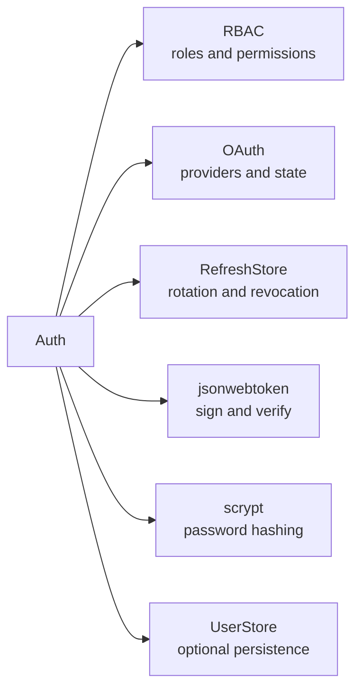
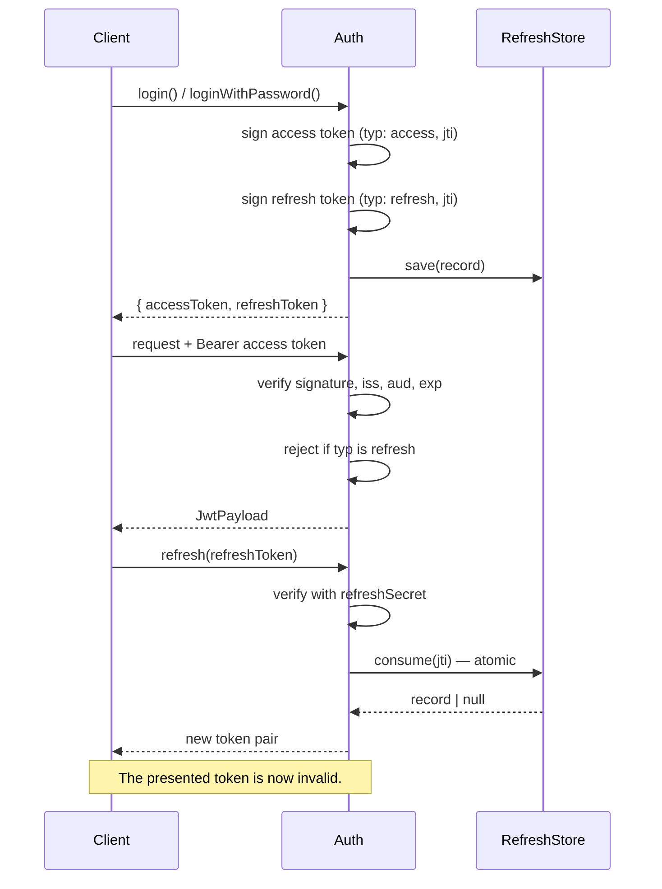
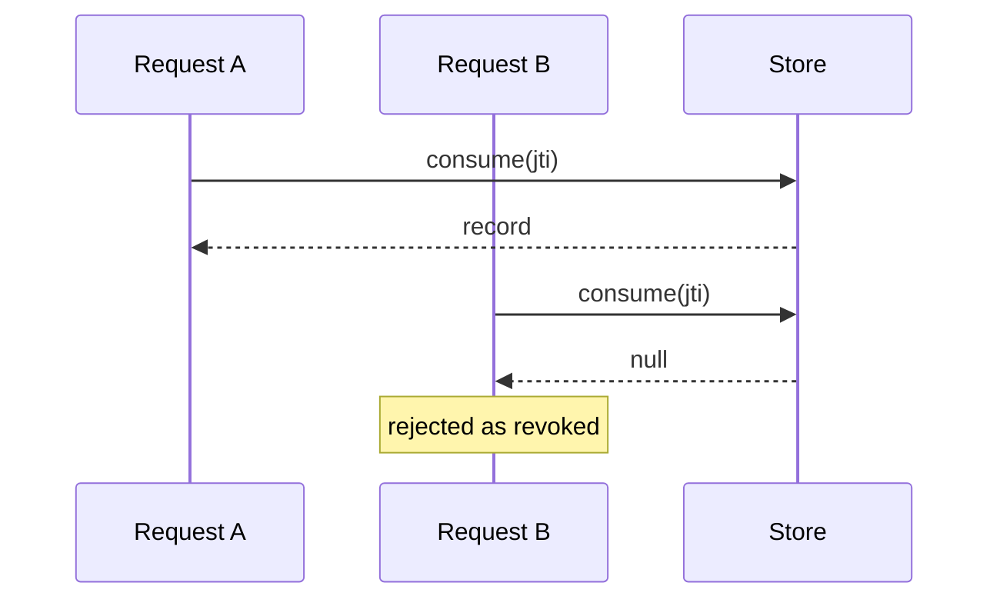
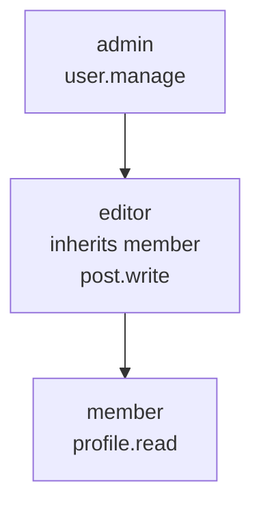
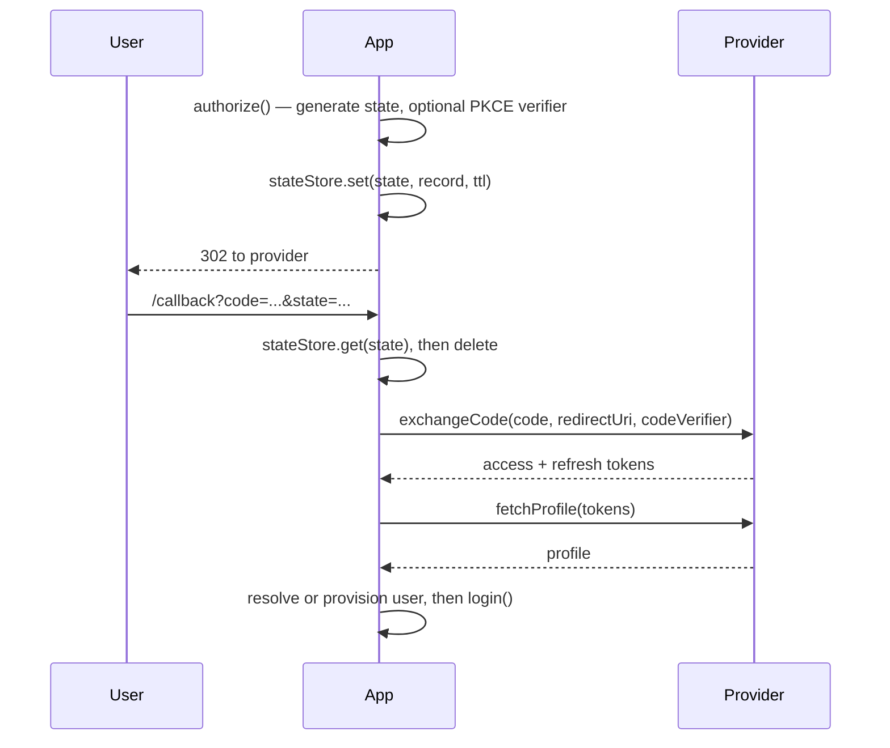

# Architecture

`@oneunit/auth` is a framework-agnostic authentication package. It issues and
validates JWTs, evaluates RBAC, hashes passwords, and drives OAuth 2.0 / OIDC
social login, with thin adapters for Express, Fastify, Koa, and
uWebSockets.js.

It depends only on `jsonwebtoken` and Node's built-in `crypto`. It declares no
peer dependencies at all: the adapters never import Express, Fastify, or Koa,
they duck-type the request and response objects they are given. A consumer can
install `@oneunit/auth` in a worker with no HTTP framework present.

## Module layout

```text
src/
  index.ts       Public surface. Re-exports and the only file consumers should import.
  types.ts       Shared interfaces. No runtime code.
  errors.ts      AuthError hierarchy with `code` and `status`.
  utils.ts       Header/cookie/query parsing, TTL math, fetch helpers.
  jwt.ts         Thin wrapper over jsonwebtoken. encode / decode / PKCE-aware token types.
  rbac.ts        Roles, permission resolution, wildcard matching.
  password.ts    scrypt hashing with a self-describing hash format.
  oauth.ts       OAuth flow, state store, provider registry.
  providers.ts   Built-in provider definitions and the custom provider factory.
  adapters.ts    Express, Fastify, Koa, and uWS request/response glue.
  auth.ts        The Auth class: the composition point for everything above.
  roles.ts       Compatibility re-export of ./rbac.js.
  token.ts       Compatibility re-export of ./jwt.js.
```

`auth.ts` is the only module that knows about all the others. Everything else is
independently importable, which is why the JWT, RBAC, and password helpers are
exported standalone — a worker that only needs to verify a token should not pull
in the OAuth machinery.

## The Auth class

`createAuth(options)` returns an `Auth` instance. The constructor validates its
input, then wires four subsystems:



`UserStore` is entirely optional. Without it, `login()` still mints tokens for
a user record you supply; only `register()`, `loginWithPassword()`, and the
OAuth user-provisioning paths require it.

### Login pipeline

1. Reject a record without an `id`
2. Run `beforeLogin` hooks
3. Normalize `roles` from `user.roles` and `user.role`
4. Resolve permissions from those roles
5. Run registered claim extractors
6. Merge `sub`, `userId`, profile fields, roles, permissions, extra claims
7. Sign the access token, stamping a `jti` and `typ: "access"`
8. Unless `refresh: false`, sign the refresh token with its own `jti` and
   persist the record to the `RefreshStore`
9. Run `afterLogin` hooks and `onLogin`

Step 4 is the security-relevant one. Permissions are computed from roles only;
see [Trust boundaries](#trust-boundaries).

## Token lifecycle



### Two token types, one secret by default

Access and refresh tokens are both JWTs. `refreshSecret` defaults to `secret`,
so both are signed with the same key and distinguished only by the `typ` claim:

| | Access token | Refresh token |
| :--- | :--- | :--- |
| `typ` | `access` | `refresh` |
| Signed with | `secret` | `refreshSecret` |
| Default TTL | `15m` | `7d` |
| Carries | `roles`, `permissions`, profile | `sub`, `userId`, `roles` |
| Accepted by | `verify()` | `refresh()` only |
| Contains | identity claims | no permissions |

Set a distinct `refreshSecret` to get real key separation. Keeping one secret is
still safe, because `verify()` refuses a `typ: "refresh"` token outright.

### Refresh rotation

Every `refresh()` call consumes the presented token. This is the reason
`RefreshStore` has a `consume()` method:



`get()` followed by `revoke()` is two round-trips, so two concurrent requests
can both observe a valid token and both receive a fresh session. `consume()` must
be a single atomic operation:

| Store | Atomic primitive |
| :--- | :--- |
| Redis | `GETDEL key` |
| PostgreSQL | `DELETE FROM sessions WHERE id = $1 RETURNING *` |
| MongoDB | `findOneAndDelete({ _id })` |
| In-memory | `Map.get` then `Map.delete` with no `await` between |

`revoke()` and `consume()` are not optional. If a store implements neither,
`refresh()` and `logout()` throw `ConfigurationError` rather than report a
logout that never happened. For logout the two are interchangeable — both remove
one id — so a `consume`-only store supports both operations. Rotation is stricter:
having reached that path, `consume` is already absent, so `revoke` is required.

## Trust boundaries

The package draws a hard line between values it derived and values it was
handed. Three boundaries matter most.

### Roles come from your code, not the request

`register()` discards a `roles` field in its input argument. A public sign-up
form posts straight into that argument, so honoring the field would let anyone
mint themselves an `admin` token. Pass roles through the second, server-side
argument:

```js
await auth.register({ email, password }, { roles: ["member"] });
```

`loginWithOAuth()` applies the same rule, taking roles from its options rather
than the provider profile.

### `auth.login()` expects a verified user record

`login()` is a low-level primitive: it signs whatever record you hand it. It
does not check passwords and does not know whether the roles are legitimate.
Resolve the user through `loginWithPassword()` or your own store first.

Never pass a request body straight into `login()`:

```js
// Vulnerable: the caller picks their own roles.
auth.login({ id: req.body.id, roles: req.body.roles });

// Correct: the roles come from your authorization rules.
const user = await store.findById(req.body.id);
auth.login({ ...user, roles: rolesFor(user) });
```

### Permissions are derived, not stored

A `permissions` array on the user record is **not** copied into the access
token. If it were, one attacker-writable database column would be equivalent to
full privilege escalation, and the RBAC configuration would be advisory.

Permissions come from `rbac` role definitions. Set `trustUserPermissions: true`
only when a separate write path guarantees the column is server-controlled.

Direct permissions still work for explicit subjects, where the caller supplies
them in code rather than from storage:

```js
rbac.can({ roles: ["member"], permissions: ["beta.access"] }, "beta.access");
```

### `defaultRole` applies to a null subject too

A subject with no roles — **including `null` and `undefined`** — is assigned
`defaultRole`. This is intentional, and it means:

```js
const rbac = createRBAC({ defaultRole: "admin", roles: { admin: { permissions: ["*"] } } });

rbac.can(null, "anything");   // true
rbac.can({}, "anything");     // true
```

So `defaultRole` is a grant to anonymous callers, not just a convenience for
roled users. Two consequences:

1. Keep `defaultRole` unprivileged. A guest/user default is the safe choice; an
   admin default turns any missed null check into full privilege escalation.
2. Always check for a subject before asking. The bundled adapters do this
   (`if (!req.user) return 401`) before calling `can`, but your own middleware
   may not:

```js
// Grants the default role to anonymous callers.
if (auth.can(ctx.state.user, "post.write")) { ... }

// Correct: no subject, no grant.
if (ctx.state.user && auth.can(ctx.state.user, "post.write")) { ... }
```

### Role inheritance

A role can inherit from parents, and resolution is cycle-safe. Permissions
resolve as: direct grants on the role, then every ancestor's grants.



## Wildcard matching

`matchPermission(granted, needed)` supports two wildcards:

| Granted | Matches | Does not match |
| :--- | :--- | :--- |
| `*` | anything | — |
| `posts.*` | `posts.create` | `posts.a.b`, `postsx.create` |
| `posts.**` | `posts.create`, `posts.a.b` | `comments.create` |

`*` stays within one dot-separated segment. `**` spans any number of segments.
Wildcards never cross a segment boundary, so `post.*` does not match
`posts.create`.

`can()` requires every requested permission to be satisfied. A granted `*`
satisfies all of them.

## Password hashing

Passwords use Node's `scrypt` with a self-describing format, so cost parameters
travel inside the hash and can be raised later without invalidating old ones:

```text
scrypt$N$r$p$keyLength$salt$hash
```

`needsRehash()` compares a stored hash against current defaults, and
`loginWithPassword()` transparently rehashes on a successful login when the
user store implements `updatePassword`.

Verification is constant-time via `timingSafeEqual`, and returns `false` rather
than throwing for any malformed or unparsable hash. Cost parameters are read
from the stored hash, so Node's own `maxmem` limit is what bounds a hostile
value — do not treat the hash column as attacker-controlled storage.

## OAuth



State is single-use: it is read and deleted before the code exchange, so a
replayed callback fails. Public clients should enable `pkce`; without PKCE and
without state there is no CSRF binding on the callback.

`loginWithOAuth()` accepts the callback params as a full URL, a path with a
query, a leading `?code=...`, a bare query string, or a plain object.

### How each provider establishes identity

Most providers return a profile by calling the provider's userinfo endpoint with
the access token, so the **provider itself** verifies the identity. Those are
server-verified by construction.

`apple` is the exception: Sign in with Apple returns the profile inside the
`id_token` from the code exchange, so the claims are read locally. `iss`,
`aud` (against your `clientId`), and `exp` are validated, and a mismatch throws
`ProviderError`.

**The `id_token` signature is not verified.** No JWKS fetch, no RS256 check.
This is not reachable through `loginWithOAuth()`, because the token is always
obtained by this library from Apple over TLS using your `clientSecret` — the
caller only ever supplies a `code`. It matters if you ever forward an
`id_token` from a native app or another service into this code path, where a
forged token would be accepted. If you do that, verify the signature against
`https://appleid.apple.com/auth/keys` and check `nonce` before calling
`loginWithOAuth()`.

A profile must carry a stable subject id. Without one, the fallback user id
would be `` `${provider}:${profile.id}` `` and every user of that provider would
share the subject `"google:undefined"`, so the call throws `ProviderError`
instead. Map the identifier explicitly:

```js
const acme = createProvider({
  id: "acme",
  authorizationUrl: "...",
  tokenUrl: "...",
  userInfoUrl: "...",
  profileMap: { id: "account_id", email: "email", name: "full_name" },
});
```

The state store is in-memory by default. Provide your own `StateStore` backed by
Redis or your session layer to make the flow work across multiple instances.

## Adapters

Adapters are thin. Each one extracts a token, calls `verify()`, and maps errors
to a response. They do not cache, and they do not hold state between requests.

| Adapter | Reads token from | Attaches to | Notes |
| :--- | :--- | :--- | :--- |
| Express | `req.headers`, `req.cookies`, `req.query`, `req.getHeader` | `req.user`, `req.token` | `next(error)` when `passthrough` |
| Fastify | request headers, cookies, query | `request.user` | `optional` honored from plugin or route |
| Koa | `ctx.request` | `ctx.state.user` | downstream errors propagate to Koa |
| uWS | `getHeader`, `getQuery`, `forEach` | snapshot object | request snapshotted before any `await` |

### Header shapes

uWebSockets.js is not a normal Node request. It is single-threaded and its
`res` object is only valid until the next tick, so `snapshotUwsRequest()` copies
method, URL, query, and headers into a plain object before any `await`.

Two `forEach` conventions exist in the wild and both are supported:

| Source | Signature | Example |
| :--- | :--- | :--- |
| uWS `HttpRequest` | `(key, value)` | native to uWebSockets.js |
| WHATWG `Headers` | `(value, key)` | `fetch` / `Request` / `Response` |

`collectHeaders()` detects which one it is looking at. Conflating them silently
yields zero headers and a 401 on every request, so both paths have dedicated
tests.

### Error mapping

Every error extends `AuthError` and carries `code` and `status`. Adapters send
`{ error, message }` and never leak a stack.

| Class | `code` | HTTP |
| :--- | :--- | :--- |
| `InvalidTokenError` | `INVALID_TOKEN` | 401 |
| `TokenExpiredError` | `TOKEN_EXPIRED` | 401 |
| `UnauthorizedError` | `UNAUTHORIZED` | 401 |
| `ForbiddenError` | `FORBIDDEN` | 403 |
| `OAuthError` | `OAUTH_ERROR` | 401 |
| `ProviderError` | `PROVIDER_ERROR` | 502 |
| `ValidationError` | `VALIDATION_ERROR` | 400 |
| `ConfigurationError` | `CONFIGURATION_ERROR` | 500 |

## Extension points

| Hook | Signature | Use |
| :--- | :--- | :--- |
| `registerExtractor(name, fn)` | `(user) => value` | Add a claim derived from the user || `hook("beforeLogin", fn)` | `(payload, auth)` | Reject or annotate before signing |
| `hook("afterLogin", fn)` | `(result, auth)` | Audit a successful login |
| `hook("afterVerify", fn)` | `(claims, auth)` | Audit a verification |
| `onLogin(result)` | `() => unknown` | Fire-and-forget login event |
| `onLink(event)` | `({ user, provider, profile })` | React to account linking |

A claim extractor that throws sets its claim to `null` rather than failing the
login, so one bad extractor cannot take down authentication.

Extractors and `additionalClaims` run *after* the derived claims, so a name
collision would otherwise rewrite the token's identity. These names are
reserved and refused:

`sub`, `userId`, `roles`, `permissions`, `typ`, `iss`, `aud`, `exp`, `iat`,
`nbf`, `jti`

`registerExtractor()` throws on a reserved name, reserved keys inside an
object returned by an extractor are dropped, and `login()` rejects an
`additionalClaims` entry that names one. Everything else — `name`, `email`,
`tier`, `tenantId` — is yours to set.

## Configuration reference

| Option | Default | Notes |
| :--- | :--- | :--- |
| `secret` | — | **Required.** Construction throws without it. |
| `refreshSecret` | `secret` | Set separately for key separation. |
| `issuer` / `audience` | — | Verified on every token. |
| `algorithm` | `HS256` | Pinned; never negotiated from the token header. |
| `accessTokenTtl` | `15m` | Also settable per login. |
| `refreshTokenTtl` | `7d` | Also settable per login. |
| `clockTolerance` | `0` | Seconds of leeway for `exp` / `nbf`. |
| `trustUserPermissions` | `false` | See [Trust boundaries](#trust-boundaries). |
| `rbac` / `roles` | `new RBAC()` | Accepts an `RBAC` instance or options. |
| `userStore` | `null` | Required only for register and password login. |
| `refreshStore` | in-memory | Should be shared and atomic. |
| `oauth` / `providers` | empty | Built-in or custom providers. |

A TTL must be a number of seconds or a timespan this package can parse: `s`,
`m`, `h`, `d`, `w`. Anything else (`"1y"`, `"2 hours"`) throws
`ValidationError` at signing time, so the signed token and any locally computed
expiry can never disagree.

## Security invariants

The behaviors below are covered by `test/security.test.ts`. If a change breaks
one, that test should fail.

1. `verify()` rejects a token whose `typ` is `refresh`
2. `register()` ignores roles in its input argument
3. Access token permissions come from roles, not the user record
4. `revoke()` and `refresh()` throw rather than no-op on a store that cannot invalidate
5. A refresh token is consumable exactly once, including under concurrency
6. `revoke()` pins the configured algorithm and rejects access tokens
7. The Koa adapter does not convert downstream errors into auth failures
8. The Fastify adapter honors `optional` set on the plugin
9. `alg: none`, cross-secret, and cross-algorithm tokens are rejected
10. Unparsable TTLs throw instead of silently defaulting
11. `loginWithOAuth()` refuses to mint a token without a provider subject id
12. Hostile scrypt parameters return `false` rather than throwing or hanging
13. RBAC inheritance cycles terminate, and `can()` denies an empty permission list
14. Extractors and `additionalClaims` cannot set a reserved identity or permission claim

## Related

- [README.md](./README.md) — API tour
- [CHANGELOG.md](./CHANGELOG.md) — release history
- [../../docs/security.md](../../docs/security.md) — workspace-wide security notes
