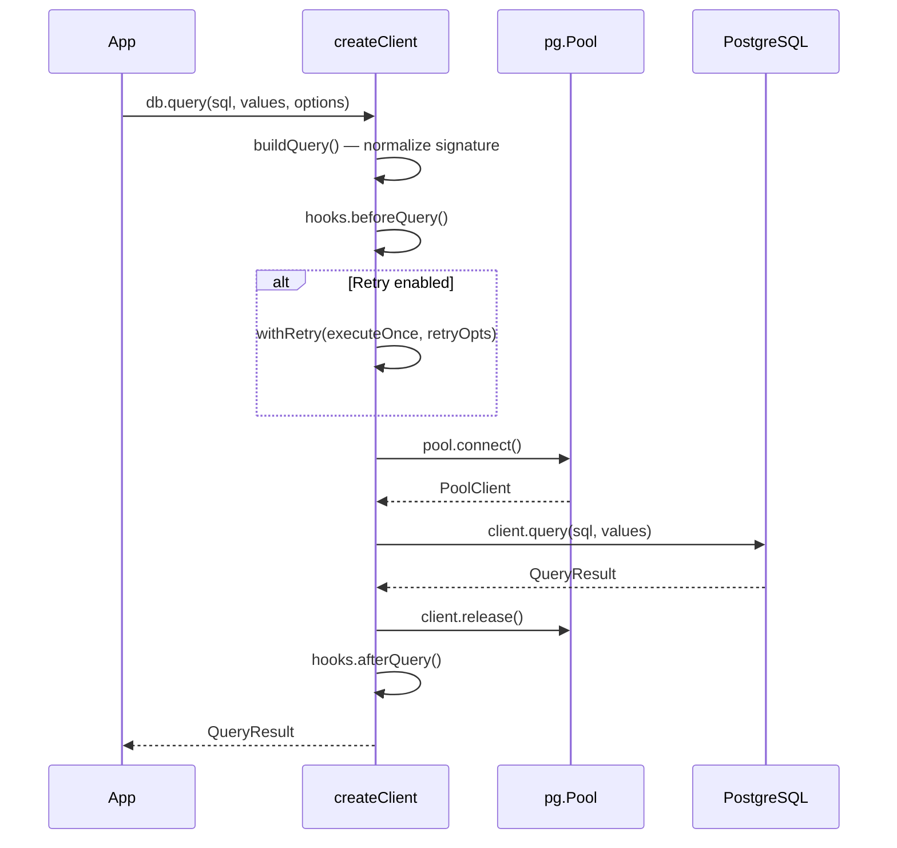
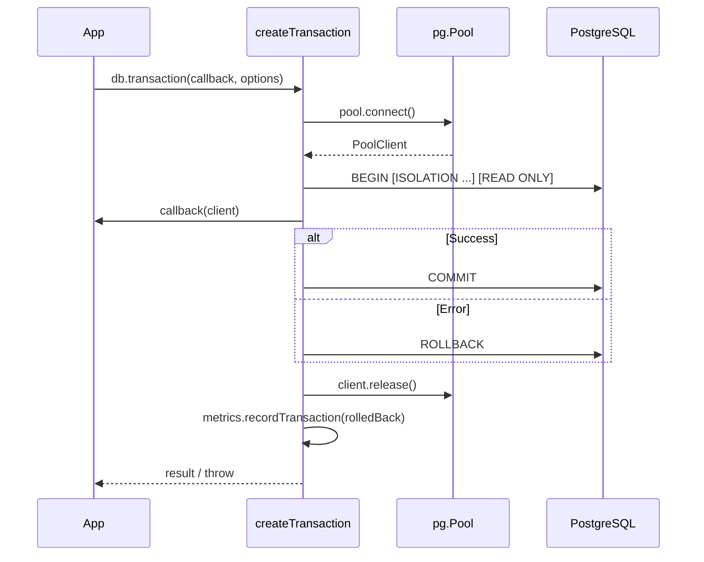
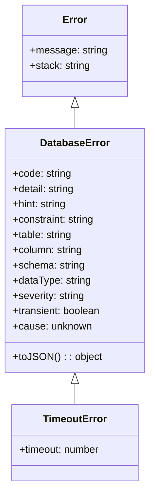
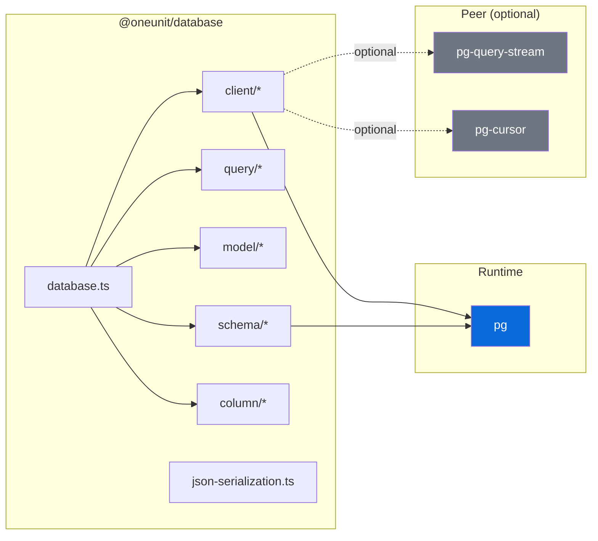

# Architecture

> Internal design reference for `@oneunit/database`. For usage, see [README.md](README.md).

---

## Table of Contents

- [Project Layout](#project-layout)
- [Design Principles](#design-principles)
- [Composition Model](#composition-model)
- [Module Map](#module-map)
  - [client/](#client)
  - [query/](#query)
  - [model/](#model)
  - [schema/](#schema)
  - [column/](#column)
  - [json-serialization](#json-serialization)
- [Data Flow](#data-flow)
  - [Query Execution](#query-execution)
  - [Transaction Lifecycle](#transaction-lifecycle)
  - [Batch Insert Pipeline](#batch-insert-pipeline)
  - [Migration Runner](#migration-runner)
- [Key Interfaces](#key-interfaces)
- [Error Architecture](#error-architecture)
- [Instrumentation](#instrumentation)
- [Dependency Graph](#dependency-graph)
- [Testing Strategy](#testing-strategy)
- [Publishing Checklist](#publishing-checklist)

---

## Project Layout

```
src/
├── index.ts                    # Public barrel — re-exports every public API
├── database.ts                 # createDatabase() — composes all subsystems
├── types.ts                    # All TypeScript interfaces and type declarations
├── json-serialization.ts       # JSON encode/decode, row/result serialization
├── pg-cursor.d.ts              # Ambient type shim for pg-cursor
│
├── client/                     # Connection & execution layer
│   ├── index.ts                # Barrel
│   ├── pool.ts                 # createPool()
│   ├── config.ts               # loadDatabaseConfig(), parseSslConfig()
│   ├── client.ts               # createClient() — query, queryOne, prepare
│   ├── transaction.ts          # createTransaction() — BEGIN/COMMIT/ROLLBACK
│   ├── batch.ts                # createBatch() — chunked multi-row INSERT
│   ├── stream.ts               # createStream() — pg-query-stream wrapper
│   ├── cursor.ts               # createCursor() — pg-cursor wrapper
│   ├── check.ts                # createCheck() — health & readiness
│   ├── shutdown.ts             # createShutdown() — idempotent pool close
│   ├── retry.ts                # createRetry(), withRetry()
│   ├── errors.ts               # DatabaseError, TimeoutError, classifiers
│   └── hooks.ts                # createHooks(), createMetrics()
│
├── query/                      # SQL construction layer
│   ├── index.ts                # Barrel
│   ├── sql.ts                  # sql`` tagged template, raw, identifier, join
│   └── builder.ts              # QueryBuilder — fluent SELECT/INSERT/UPDATE/DELETE
│
├── model/                      # Table abstraction layer
│   ├── index.ts                # Barrel
│   └── model.ts                # createModel(), createModelFactory()
│
├── schema/                     # DDL & migration layer
│   ├── index.ts                # Barrel
│   ├── schema.ts               # createSchemaManager() — facade
│   ├── create.ts               # CREATE TABLE, CREATE INDEX
│   ├── alter.ts                # ALTER TABLE (add/drop/rename/alter columns)
│   ├── drop.ts                 # DROP TABLE, DROP INDEX
│   ├── constrain.ts            # UNIQUE, FOREIGN KEY, CHECK constraints
│   └── migrate.ts              # createMigrator() — versioned migration runner
│
└── column/                     # Column definition helpers
    ├── index.ts                # Barrel
    ├── id.ts                   # id(), bigIntId(), uuid()
    └── timestamp.ts            # timestamp()
```

---

## Design Principles

### 1. Composition over Inheritance

`createDatabase()` composes independent factory functions. Each subsystem (`client`, `transaction`, `schema`, `model`, etc.) is a standalone unit that receives only its explicit dependencies. There are no base classes, no `this` binding, and no hidden shared state.

### 2. Explicit Configuration

Configuration flows through a strict precedence chain:

```
environment variables → alias fallbacks → hard-coded defaults → explicit overrides
```

`loadDatabaseConfig()` is the single source of truth. Credentials never appear in logs.

### 3. Parameterized SQL Everywhere

All user values flow through `$1, $2, …` placeholders. The `sql` tagged template and `QueryBuilder` both enforce this — identifiers are quoted, values are never interpolated.

### 4. Opt-in Retries

Retries are **off by default**. When enabled, only genuinely transient PostgreSQL errors are retried: serialization failures (`40001`), deadlocks (`40P01`), and connection-level errors. Non-idempotent writes should never use retries.

### 5. Idempotent Lifecycle

- `shutdown()` — safe to call multiple times; concurrent callers share one in-flight close
- `migrate.run()` — skips already-applied migrations under an advisory lock
- Pool creation is lazy — no connection is opened until the first query

---

## Composition Model

`createDatabase()` assembles the public `Database` object from independent factories:

```mermaid
graph TD
    CD["createDatabase(options)"]

    CD --> CP["createPool()"]
    CD --> CC["createClient(pool)"]
    CD --> CT["createTransaction(pool)"]
    CD --> CS["createStream(pool)"]
    CD --> CU["createCursor(pool)"]
    CD --> CK["createCheck(pool)"]
    CD --> SD["createShutdown(pool)"]
    CD --> CB["createBatch(query, tx)"]
    CD --> QB["createQueryBuilder(query)"]
    CD --> MF["createModelFactory(query)"]
    CD --> SM["createSchemaManager(pool)"]
    CD --> MG["createMigrator(pool)"]
    CD --> CH["createHooks(options)"]
    CD --> CR["createRetry(defaults)"]

    CC -.->|query, queryOne, prepare| DB["Database"]
    CT -.->|transaction, savepoint| DB
    CS -.->|stream| DB
    CU -.->|cursor| DB
    CK -.->|check, health| DB
    SD -.->|shutdown| DB
    CB -.->|batch| DB
    QB -.->|from, table| DB
    MF -.->|model| DB
    SM -.->|schema| DB
    MG -.->|migrate| DB
    CH -.->|hooks, metrics| DB
    CR -.->|retry| DB

    style CD fill:#0969da,color:#fff
    style DB fill:#22863a,color:#fff
```



Each factory receives only the dependencies it needs (pool, query function, logger). No factory has access to the full `Database` object.

---

## Module Map

### client/

| File | Factory | Produces | Key Dependencies |
| :--- | :--- | :--- | :--- |
| `pool.ts` | `createPool()` | `pg.Pool` | `pg`, config |
| `config.ts` | `loadDatabaseConfig()` | `DatabaseConfig` | `process.env` |
| `client.ts` | `createClient()` | `query`, `queryOne`, `prepare`, `prepared` | pool, hooks, retry |
| `transaction.ts` | `createTransaction()` | `transaction`, `savepoint` | pool, hooks, retry |
| `batch.ts` | `createBatch()` | `batch.insertMany` | query, transaction |
| `stream.ts` | `createStream()` | `stream` | pool, `pg-query-stream` |
| `cursor.ts` | `createCursor()` | `cursor` | pool, `pg-cursor` |
| `check.ts` | `createCheck()` | `check`, `health` | pool |
| `shutdown.ts` | `createShutdown()` | `shutdown` | pool |
| `retry.ts` | `createRetry()`, `withRetry()` | `RetryApi` | error classifiers |
| `errors.ts` | `normalizeError()` | `DatabaseError`, classifiers | — |
| `hooks.ts` | `createHooks()`, `createMetrics()` | `QueryHooks`, `MetricsCollector` | logger, instrumentation config |

### query/

| File | Factory | Produces |
| :--- | :--- | :--- |
| `sql.ts` | `sql` tagged template | `SqlFragment` with `.text` / `.values` |
| `builder.ts` | `createQueryBuilder()` | Fluent `QueryBuilder` (thenable) |

The `QueryBuilder` is thenable — it implements `.then()` so `await db.from("users").select()` works without calling `.execute()`.

### model/

| File | Factory | Produces |
| :--- | :--- | :--- |
| `model.ts` | `createModelFactory()` → `createModel()` | `Model` with CRUD methods |

Model methods: `find`, `findOne`, `findById`, `insert`, `insertMany`, `update`, `updateById`, `delete`, `deleteById`, `remove`, `removeById`, `count`, `exists`. Each accepts an optional `{ client }` for transactional use.

### schema/

| File | Factory | Produces |
| :--- | :--- | :--- |
| `schema.ts` | `createSchemaManager()` | `SchemaManager` facade |
| `create.ts` | — | `schema.create.table()`, `schema.create.index()` |
| `alter.ts` | — | `schema.alter.addColumns()`, `dropColumns()`, `renameColumn()`, `alterColumn()`, `renameTable()`, `unique()` |
| `drop.ts` | — | `schema.drop.table()`, `schema.drop.index()` |
| `constrain.ts` | — | `schema.constrain.unique()`, `foreignKey()`, `check()`, `dropConstraint()` |
| `migrate.ts` | `createMigrator()` | `migrate.run()`, `migrate.status()`, `migrate.rollback()` |

Migrations run under a PostgreSQL advisory lock. Each migration gets its own transaction. The migrations table is auto-created on first run.

### column/

| File | Exports |
| :--- | :--- |
| `id.ts` | `id()` → UUID PK, `bigIntId()` → BIGSERIAL PK, `uuid()` → UUID column |
| `timestamp.ts` | `timestamp(...names)` → TIMESTAMPTZ columns with `DEFAULT NOW()` |

### json-serialization

Standalone utilities for encoding/decoding rows and query results as JSON buffers:

`encode`, `decode`, `encodeToString`, `decodeFromString`, `serializeRow`, `deserializeRow`, `serializeQueryResult`, `deserializeQueryResult`

---

## Data Flow

### Query Execution



### Transaction Lifecycle



**Savepoints** nest inside a transaction — they issue `SAVEPOINT name` / `RELEASE SAVEPOINT name` / `ROLLBACK TO SAVEPOINT name` without touching the outer `BEGIN` / `COMMIT`.

### Batch Insert Pipeline

```
db.batch.insertMany(table, rows, options)
  │
  ├─ inferColumns()        — union of all keys across all rows
  ├─ chunkSize             — min(options.chunkSize, floor(65535 / columns.length))
  │
  ├─ for each chunk:
  │   ├─ build VALUES ($1,$2,...), ($3,$4,...), ...
  │   ├─ append ON CONFLICT clause (if configured)
  │   ├─ append RETURNING clause (if configured)
  │   └─ execute via query()
  │
  └─ return collected results
```

### Migration Runner

```
db.migrate.run({ directory })
  │
  ├─ pg_advisory_lock(lockKey)
  ├─ CREATE TABLE IF NOT EXISTS _migrations
  ├─ load migrations from directory / inline array
  ├─ filter out already-applied (by id)
  │
  ├─ for each pending migration:
  │   ├─ BEGIN
  │   ├─ execute up (SQL string or async function)
  │   ├─ INSERT INTO _migrations
  │   └─ COMMIT
  │
  └─ pg_advisory_unlock(lockKey)
```

---

## Key Interfaces

### `Database` — the public API surface

```typescript
interface Database {
    pool: Pool;

    // Queries
    getClient(options?): Promise<PoolClient>;
    query<T>(text, values?, options?): Promise<QueryResult<T>>;
    queryOne<T>(text, values?, options?): Promise<T | null>;
    releaseClient(client?, error?): void;
    prepare(name, text): PreparedStatement;
    prepared(name, text, values?, options?): Promise<QueryResult>;

    // Transactions
    transaction<T>(callback, options?): Promise<T>;
    savepoint<T>(client, name, callback): Promise<T>;

    // Streaming
    stream(text, values?, options?): Promise<ReadableStream>;
    cursor(text, values?, options?): Promise<CursorHandle>;

    // Health & lifecycle
    check(options?): Promise<HealthCheckResult>;
    health(options?): Promise<HealthResult>;
    shutdown(options?): Promise<void>;

    // Batch
    batch: BatchApi;

    // Query builder
    from(table): QueryBuilder;
    table(table): QueryBuilder;         // alias of `from`

    // Models
    model(table, options?): Model;

    // Schema DDL
    schema: SchemaManager;

    // Migrations
    migrate: Migrator;

    // Instrumentation
    hooks: QueryHooks;
    metrics: MetricsCollector;
    retry: RetryApi;
}
```

### `QueryBuilder`

Fluent, thenable query builder. Supports:

`select` · `distinct` · `insert` · `values` · `update` · `delete` · `returning` · `where` · `orWhere` · `whereNull` · `whereNotNull` · `whereIn` · `whereRaw` · `join` · `leftJoin` · `groupBy` · `having` · `orderBy` · `limit` · `offset` · `onConflict` · `toSQL` · `execute` · `first` · `then`

### `Model`

Table-level CRUD abstraction:

`find` · `findOne` · `findById` · `insert` · `insertMany` · `update` · `updateById` · `delete` · `deleteById` · `remove` · `removeById` · `count` · `exists` · `query` · `builder` · `select`

### `SchemaManager`

```typescript
interface SchemaManager {
    create: { table(), index() };
    alter:  { addColumns(), dropColumns(), renameColumn(), alterColumn(), renameTable(), unique() };
    drop:   { table(), index() };
    constrain: { unique(), foreignKey(), check(), dropConstraint() };
}
```

---

## Error Architecture



### Error Classification

All raw `pg` errors pass through `normalizeError()`, which maps PostgreSQL error codes to structured `DatabaseError` instances.

| Classifier | PostgreSQL Code | Transient? |
| :--- | :--- | :---: |
| `isUniqueViolation` | `23505` | No |
| `isForeignKeyViolation` | `23503` | No |
| `isNotNullViolation` | `23502` | No |
| `isCheckViolation` | `23514` | No |
| `isExclusionViolation` | `23P01` | No |
| `isSerializationFailure` | `40001` | Yes |
| `isDeadlock` | `40P01` | Yes |
| `isConnectionError` | connection-level | Yes |
| `isConstraintViolation` | `23xxx` family | No |
| `isTransientError` | any of the above | Yes |

Only errors flagged `transient: true` are eligible for automatic retry.

---

## Instrumentation

### Hook Lifecycle

```
beforeQuery(context)   →   query execution   →   afterQuery(context)
                                              └─  onQueryError(context, error)
                                              └─  recordRetry(info)
```

### MetricsCollector

All counters are in-memory, allocation-free, and lock-free:

| Metric | Description |
| :--- | :--- |
| `queries` | Total query count |
| `errors` | Total error count |
| `slowQueries` | Queries exceeding `slowQueryMs` |
| `retries` | Retry attempts |
| `transactions` | Transaction count |
| `rolledBackTransactions` | Rolled-back transactions |
| `totalDurationMs` | Cumulative query time |
| `maxDurationMs` | Slowest single query |
| `lastDurationMs` | Most recent query time |

Call `db.metrics.snapshot()` to get a frozen copy. Call `db.metrics.reset()` to zero all counters.

---

## Dependency Graph



**Zero sibling-package dependencies.** The package depends only on `pg` at runtime. `pg-cursor` and `pg-query-stream` are optional peer dependencies for streaming/cursor features.

---

## Testing Strategy

- **Runner**: Node.js built-in test runner (`node:test`)
- **Mocking**: All tests mock `pg.Pool` and `PoolClient` — no live PostgreSQL required
- **Coverage areas**: query building, transactions, retries, batch inserts, models, migrations, schema helpers, error classification, config parsing, lifecycle management

| Test File | Covers |
| :--- | :--- |
| `create-database.test.js` | `createDatabase()` composition |
| `database.test.js` | End-to-end Database API |
| `client-extended.test.js` | Query execution, prepared statements |
| `config.test.js`, `config-extended.test.js` | Environment parsing, SSL config |
| `errors.test.js` | Error normalization, classifiers |
| `lifecycle.test.js` | Health checks, shutdown |
| `retry.test.js` | Retry logic, backoff |
| `transaction-extended.test.js` | Transactions, savepoints, isolation |
| `batch-model.test.js` | Batch inserts, model CRUD |
| `migrations.test.js` | Migration runner, rollback, status |
| `query-builder.test.js` | QueryBuilder fluent API |
| `msgpack.test.js` | JSON serialization utilities |

```bash
npm test                               # run all tests
npm run test:watch                     # watch mode
node --test test/specific.test.js      # run a single file
```

---

## Publishing Checklist

```bash
# 1. Verify everything passes
npm run typecheck && npm test && npm run build && npm run pack:check

# 2. Update CHANGELOG.md (move Unreleased → version heading)
# 3. Bump version in package.json

# 4. Commit, tag, publish
git commit -am "release(database): vX.Y.Z"
git tag database-vX.Y.Z
npm publish --access public
git push origin main --tags
```