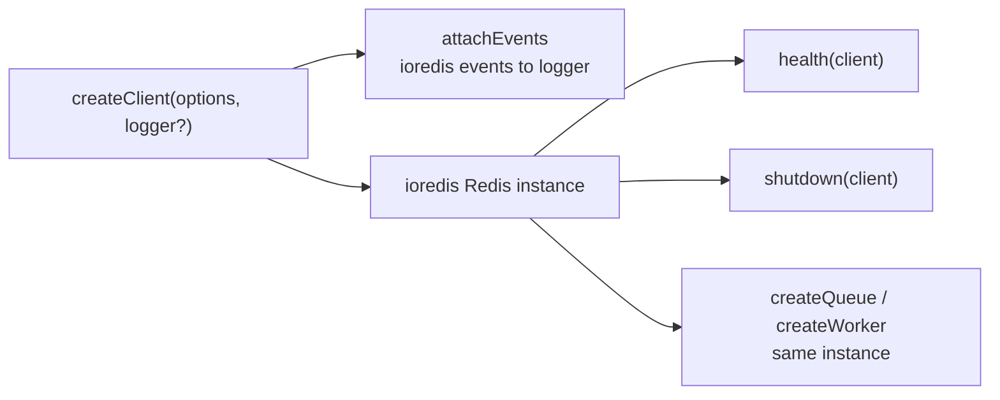
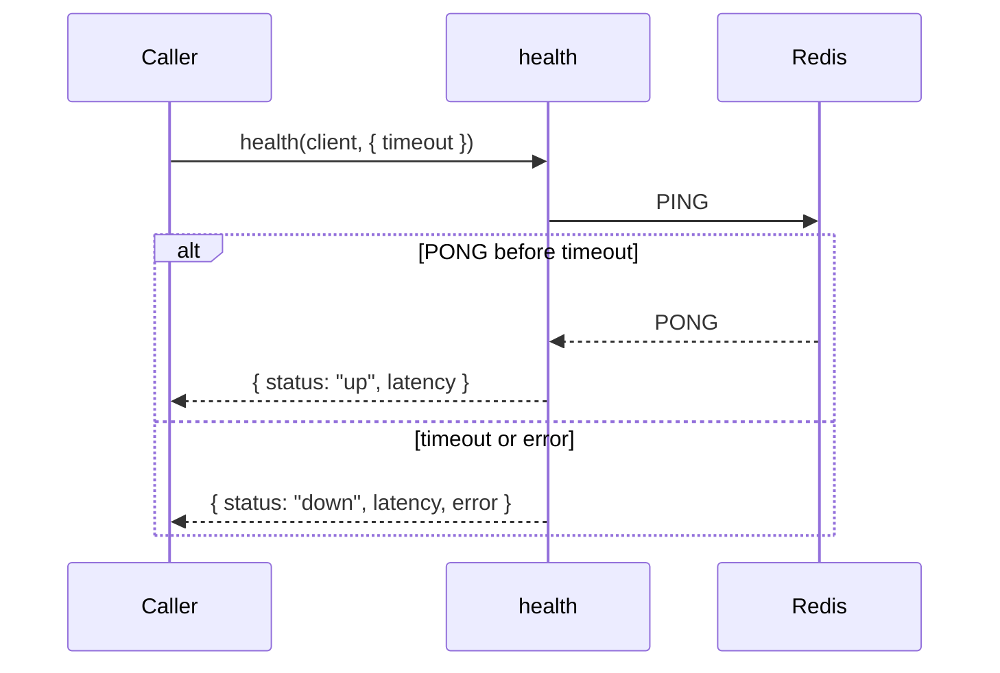
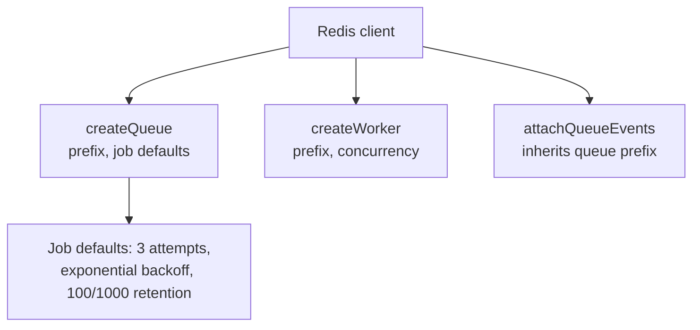
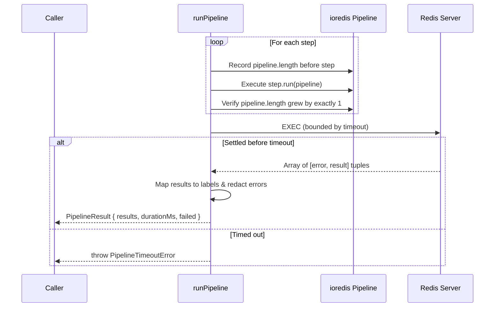

# Architecture

`@oneunit/redis` is a thin, opinionated layer over two libraries: `ioredis` for
the connection and `bullmq` for job queues. It owns very little. Its job is to
apply defaults that every consumer would otherwise get wrong, keep the surface
small, and stay out of the way.

That thinness is deliberate. There is no connection pool, no cache, no
serializer, no retry policy of its own. Whatever `ioredis` and `bullmq` do is
what this package does, and where it differs you can read why below.

## Dependencies

| Dependency | Why it is a dependency rather than a peer                                                                     |
| :--------- | :------------------------------------------------------------------------------------------------------------ |
| `ioredis`  | `createClient` constructs one. Consumers use the returned instance directly and do not install it themselves. |
| `bullmq`   | `createQueue`, `createWorker`, and `attachQueueEvents` construct BullMQ objects.                              |

There are **no peer dependencies**. The package has no opinion about your HTTP
framework, your logger, or your process manager. It also has no optional
dependency on `@oneunit/logger` — the logger is duck-typed and injected, which
is what lets this package be used in a worker with no logging library present.

## Module layout

```text
src/
  index.ts        Public surface. Re-exports the four subtrees.
  logger.ts       Logger interface, silent/console/normalize adapters, duck-typing helpers.

  client/
    index.ts      Barrel for the client subtree.
    client.ts     createClient: ioredis instance, URL handling, and BullMQ-safe defaults.
    events.ts     attachEvents, redactError: maps ioredis events onto logger, sanitizes secrets.
    check.ts      health: bounded PING with latency measurement.
    shutdown.ts   shutdown: graceful QUIT, idempotent teardown, WeakSet forced disconnect tracking.

  queue/
    index.ts      Barrel for the queue subtree.
    queue.ts      createQueue: BullMQ Queue with safe job defaults and per-key option merging.
    worker.ts     createWorker: BullMQ Worker with selective option forwarding.
    events.ts     attachQueueEvents: ManagedQueueEvents wired to logger with prefix inheritance.

  pipeline/
    index.ts      Barrel for the pipeline subtree.
    builder.ts    runPipeline, pipelineValues: batched commands, positional enforcement, bounded timeout, error redaction.
```

### Subpath Exports & Modular Boundaries

The package configures granular subpath exports in `package.json` to allow consumers to import isolated components without loading unnecessary modules:

| Subpath                   | Target File                 | Purpose & Dependency Surface                                              |
| :------------------------ | :-------------------------- | :------------------------------------------------------------------------ |
| `@oneunit/redis`          | `./dist/index.js`           | Full public surface (client, queues, workers, events, logger, pipeline).  |
| `@oneunit/redis/client`   | `./dist/client/index.js`    | Redis client, health checks, shutdown, events. **Zero BullMQ imports**.  |
| `@oneunit/redis/queue`    | `./dist/queue/index.js`     | BullMQ Queue, Worker, and QueueEvents. Accepts an injected Redis client.  |
| `@oneunit/redis/pipeline` | `./dist/pipeline/index.js`  | Pipeline execution (`runPipeline`, `pipelineValues`). Isolated batching.  |

`client/` and `queue/` never import each other. The queue subtree knows nothing
about health checks or event logging; it takes a connection you hand it and
configures BullMQ. `client/` never imports BullMQ at all. This is what allows
the subpath imports (`@oneunit/redis/client`, `@oneunit/redis/queue`) to pull in
only half the dependency surface.

`pipeline/` is layered on top of `client/` and imports `redactError` from it. It
deliberately sits in its own subtree rather than under `client/`, so
`@oneunit/redis/pipeline` does not drag in the connection helpers, and
`@oneunit/redis/client` does not drag in the batching helper.

## The client



`createClient` returns a plain `ioredis` `Redis` instance. It is not wrapped,
proxied, or subclassed, so every ioredis method and command is available and
`bullmq` accepts the instance directly.

Three defaults carry the weight of this package.

**`url` is passed positionally.** ioredis only reads `url` from the first
constructor argument. An options object carrying `url` is silently ignored and
the client connects to `localhost:6379`. `createClient` therefore calls
`new Redis(url, options)` when a URL is present, which is also why `url` falls
back to `REDIS_URL` — otherwise a typo in the environment would fail quietly at
runtime instead of at construction.

For the same reason a URL string is accepted directly, as
`createClient("redis://host:port")`. That is `new Redis(url)`'s own signature and
the form people reach for first; destructuring a string as an options object
produces no `url`, so the client would connect to `localhost:6379` with nothing
to indicate the mistake.

**`maxRetriesPerRequest` defaults to `null`.** ioredis defaults it to `20`;
bullmq refuses any connection where it is set, with `Your redis options
maxRetriesPerRequest must be null`. Since `createQueue` and `createWorker` are
designed to take this same instance, the default has to satisfy bullmq or the
documented usage does not work. Consumers who want ioredis's own retry ceiling
can pass it, at the cost of bullmq refusing the client.

**`lazyConnect` defaults to `true`.** Constructing a client opens no socket. The
first command connects. This keeps module import side-effect free and lets a
process start without Redis being up yet.

### Event logging

`attachEvents` maps five ioredis events to the logger: `connect`, `ready`,
`reconnecting`, `error`, and `close`. Two details matter:

The `error` listener is **always registered**, even when no logger is passed.
ioredis emits `error` on a failed connection; an `EventEmitter` with no
`error` listener throws, so skipping registration would turn every transient
outage into a process crash.

Message and extra are passed as `(message, extra)`, matching the `Logger`
interface. The `logger` parameter is optional everywhere in this package, so
every call site uses optional chaining.

pino is the one exception. It takes `(bindings, message)` and merges the first
argument into the record, so those two positions are passed the other way round.
There is no way to tell the signatures apart from a log call, so the logger has
to be detected: a pino instance carries both a `bindings()` method and a
`levels` map, and `child()` loggers inherit them.

Detection deliberately avoids `child()`. `child?()` is part of this package's
own `Logger` interface, so every conforming logger has one and using it as the
signal swapped arguments for all of them, putting the message in the bindings
slot of every record. A caller who has a logger with `child()` that takes
`(message, extra)` gets the documented order.

## Health checks



The timeout is not a nicety. ioredis queues commands while reconnecting, so a
`PING` against an unreachable server does not reject — it waits in the offline
queue indefinitely. Without a bound, `health()` never settles and a health
endpoint wired to it hangs instead of reporting `down`, which is the one
situation a health check exists for.

The deadline timer stays **ref'd**, and is cleared in a `finally`. An `unref`'d
timer looks tidier but is wrong here: if the timer is the only thing keeping the
event loop alive, Node exits before the promise settles and the caller never
learns the result. A non-finite or non-positive `timeout` falls back to the
default rather than being coerced to 1ms by `setTimeout`, which would also emit
a `TimeoutNaNWarning` per call.

## Graceful shutdown

`shutdown` issues `QUIT` and waits for pending replies. It is **idempotent**:
once ioredis reports status `end`, the connection is gone for good and `QUIT`
rejects with `Connection is closed.`, so a second call is a no-op. This matters
because applications routinely register a handler on both `SIGINT` and
`SIGTERM`, and the second signal should not produce an unhandled rejection
during teardown.

A connection that dies _during_ `QUIT` is also treated as disconnected, and
logged as a warning rather than rethrown. A genuine failure on a still-live
connection is logged and rethrown, so a broken shutdown is never silent.

`QUIT` is a queued command, so a client stuck in `reconnecting` parks it in the
offline queue and the promise never settles. After a 5s deadline the connection
is torn down with `disconnect()` so the retry loop stops and the process can
exit — the caller asked to disconnect, and it does, one way or another.

That forced close needs its own record. `disconnect()` only reaches ioredis's
`closeHandler` from a live connection; on a client in `reconnecting` the
connector has nothing to close, so the status never becomes `end` even though
the retry timer has been cleared and the connection can never come back.
Without remembering the forced close, a second `shutdown` would wait out the
full 5s deadline again for a connection that is already gone. The bookkeeping
lives in a `WeakSet` rather than on the client, so it does not appear in
`Object.keys`, in a serialised snapshot, or in BullMQ's own inspection.

## Queues



All three take the same connection and default `prefix` to `"queue"`, so the
common case needs no prefix at all.

**Undefined keys are never forwarded.** bullmq merges its own defaults with
`Object.assign`, so a key present with the value `undefined` still overrides the
default. Passing `concurrency: undefined` when the caller omitted it therefore
tripped bullmq's setter with `concurrency must be a finite number greater than
0` and made `createWorker` unusable without an explicit concurrency. Both
factories now include a key only when the caller actually set it.

`createQueue` also merges `defaultJobOptions` over the package defaults, so
overriding `attempts` alone leaves the backoff and retention settings intact.
The merge is per key rather than a spread, for the same reason as above: a spread
writes `undefined` for every unset key, which erases the default instead of
falling through to it. That bit a config assembled by spreading another object,
`{ ...base, attempts: maybeUndefined }`, which silently lost the 3-attempt retry.
`null` is a deliberate value and passes through unchanged, since bullmq reads
`removeOnComplete: null` as "keep this job forever".

`attachQueueEvents` derives its prefix from `queue.opts.prefix` rather than
defaulting to a literal. bullmq keys every event stream on the prefix, so a
queue created with a custom prefix and a listener defaulting to `"queue"`
receives **no events at all**, with no error to explain why. An explicit
`prefix` in the config still wins.

Bullmq requires a dedicated blocking connection for `Worker` and `QueueEvents`;
it duplicates the client you pass for that purpose. Closing the queue or worker
closes the duplicate, not your client — that is what `shutdown` is for.

`QueueEvents` also needs its `close()` wrapped, and the reason is narrow but
important. BullMQ's own `close()` awaits the connection's `initializing` promise
before disconnecting; against a server that never came up, that promise rejects
and `close()` throws, leaving the duplicated client in its reconnect loop. Nothing
in the caller's scope holds a reference to that duplicate, so the process can
never exit. The wrapper drives the connection closed directly and rethrows only
errors that are *not* the connection already being gone.

Deciding "already gone" structurally rather than by message is not a style
preference. BullMQ introduced `ConnectionClosedError` for exactly this reason —
its own comment on the class says it exists so callers can use `instanceof`
"rather than fragile message-substring matching" — and the message is not stable:
some of BullMQ's own construction sites pass ioredis's `"Connection is closed."`,
some pass their own wording, and some pass nothing, in which case the class
default `"Connection is closed"` (no trailing period) applies. An exact string
comparison therefore rethrows precisely the failures the wrapper exists to
absorb. The string checks remain as a fallback, because `instanceof` cannot match
across two copies of `bullmq` in one tree.

## Pipelines



`runPipeline` wraps `client.pipeline()`. It does not reimplement batching; the
only reason it exists is that ioredis's own pipeline API fails in ways that are
invisible at the call site.

**A failed command does not fail the batch.** `EXEC` resolves with a
`[error, null]` tuple for the command that failed and `null` for its value:

```ts
const [result] = await client.pipeline().incr("a-string-key").exec();
// [ [ Error: ERR value is not an integer or out of range, null ] ]
```

The common way to read a pipeline is `results.map(([, value]) => value)`, which
turns that into `[null]` — indistinguishable from a command that legitimately
returned null, and from a successful write that never landed. So `runPipeline`
returns one `PipelineStepResult` per command, each with a `label` the caller
chose and an explicit `error` field. The label is what makes a failure
identifiable: a bare `results[7]` says nothing about which of several hundred
commands broke.

**`EXEC` can hang forever.** ioredis parks queued commands while reconnecting
and does not flush them until the connection is back, so a pipeline against an
unreachable server never settles — verified directly, a 2.5s race elapsed with
the client still in `reconnecting` and the promise unresolved. This is the same
failure `health` and `shutdown` are bounded against, and `runPipeline` bounds it
the same way, with `PipelineTimeoutError` after `options.timeout` (default 5s).

**Command errors carry their arguments.** ioredis attaches the failing command
to its errors, and for `AUTH` those args are the password. A `results` array is
a natural thing to log wholesale, so redaction happens once, in `runPipeline`,
before the array is handed back — rather than being left to each call site to
remember. A rejected `exec()` takes the same path: it is a connection-level
failure rather than a per-command one, so it never reaches the tuple mapping
above, and passing it through unredacted would leave the module promising a
guarantee it did not keep on that path.

**One command per step.** Results are paired with `steps` by position, so the
queue has to grow by exactly one per step. `runPipeline` reads ioredis's own
queue length (`pipeline.length`, a getter over the internal queue) before and
after each step and raises `PipelineStepError` if it did not. This is not
defensive decoration — it is the only thing standing between a caller and a
wrong answer, because both ways of breaking the pairing are invisible:

- a step queuing two commands shifts every later result by one, so
  `results[3].label` names one command and `results[3].value` is another
  command's;
- an `async` step queues nothing synchronously, so `exec()` is sent first and
  the command lands in a pipeline that has already gone out.

`PipelineStep.run` is typed `(pipeline) => void`, and TypeScript permits
returning any value from a `void` signature — including a promise — so neither
compiles as an error. The return value is inspected directly for that reason,
because an `async` step is the one failure a count alone would misreport as
"queued 0 commands" rather than naming the cause.

Two design decisions worth stating:

- **`runPipeline` takes steps, not commands.** A `{ label, run }` pair rather
  than a pre-built command list, because the label and the command have to be
  kept in step; positional pairing is exactly the failure mode the label exists
  to prevent. A `run` that throws fails the whole batch rather than being
  skipped, since dropping the command would shift every later result by one and
  return a value against the wrong label.
- **`throwOnError` is off by default.** A partial batch is a legitimate outcome
  for a batch of independent writes, and forcing every caller to opt into
  strictness would make the common case noisier. `pipelineValues` is the strict
  path, for when a caller wants values and cannot tolerate a silently failed
  write.

## Trust boundaries

Redis is a shared, unauthenticated-by-default resource, and this package makes
no attempt to sandbox it. Specifically:

- **`connection` is trusted.** It is whatever the caller passes, and bullmq
  drives it. The package never validates or rewrites connection internals
  beyond the documented defaults.
- **`keyPrefix` is unsupported.** bullmq rejects an ioredis client configured
  with `keyPrefix` outright (`ioredis does not support ioredis prefixes, use
the prefix option instead`). Use bullmq's `prefix` on the factories.
- **`url` is parsed by ioredis, not here.** Credentials in `REDIS_URL` are the
  caller's to protect. Do not log the URL.
- **Every error that reaches the logger is redacted.** ioredis attaches the
  failing command to its errors, and for `AUTH` (and `HELLO`) that command's args
  are the password in plaintext. `redactError` replaces those args while keeping
  the message, which is what tells an operator _why_ authentication failed.
  All three error paths run it: the client `error` event, the `QueueEvents`
  `error` event, and `shutdown`'s own failure report. `QueueEvents` matters most
  because it duplicates the caller's client, so it authenticates with the same
  password and repeats the failure on every reconnect attempt.
- **Queue names become Redis key names.** bullmq rejects a name containing
  `:`, which is what prevents one queue from addressing another's keys. Names
  are otherwise not sanitized, so treat them as trusted input.
- **The logger receives job data.** `attachQueueEvents` logs `failedReason` and
  `data`. If job payloads carry secrets, either do not attach events or use a
  logger that redacts.

## Testing

Tests use the Node built-in runner (`node:test`) via `tsx`. Cases that need a
live Redis probe for reachability first and return early when there is none, so
the suite passes offline; those tests no-op rather than fail when no server is
listening. That no-op is deliberate for a local run and a trap in CI — a green
build proves nothing about the queue, worker, or pipeline paths unless a server
is actually there — so the `verify` job starts a `redis` service container, as
does the release smoke test.

The guard is needed for a bare `client.ping()` too, not only for BullMQ objects.
`createClient` defaults `maxRetriesPerRequest` to `null` because BullMQ requires
it, and `null` means ioredis never gives up on a queued command — so an unguarded
`await client.ping()` against an absent server parks in the offline queue and
never settles, hanging the run rather than failing it. It lives in one place,
`test/helpers.ts`, because it used to be copied per file and the copies drifted.

The runner executes test files in parallel child processes and every one of them
imports `../dist/index.js`, so a test that rebuilds `dist/` takes it away from its
siblings mid-run. That is why the packaging test uses
`npm pack --dry-run --ignore-scripts`: without the flag, `prepack` runs `build`,
whose `clean` step deletes `dist/`.

## Packaging

`files` lists `src` as well as `dist`. The compiler emits `.js.map` and
`.d.ts.map` that reference `../src/*.ts`, so shipping `dist` alone leaves every
map pointing at a file the consumer does not have: stack traces fall back to
compiled JavaScript and editor go-to-definition does nothing, with no warning.
A CI step resolves each map's `sources` against the installed package and fails
if any target is missing.

`npm run build` removes `dist` and `tsconfig.tsbuildinfo` first. `tsc` never
deletes output for a source file that has been removed, so a deleted module's
compiled copy would otherwise stay in the tarball indefinitely — and one was
published this way before the clean step existed.

Regression tests here are written to **fail against the bug they cover**. That
is verified by reintroducing the defect into the compiled output and confirming
the suite goes red, because a test that passes against broken code protects
nothing. Two examples worth knowing about:

- The missing-logger test asserts on `console.error`, because bullmq's `emit`
  catches a throwing listener and retries the event as `error`, which swallows
  the throw. A plain "does not throw" assertion passes against the bug.
- The health-timeout test runs in a child process, because the failure mode is
  Node exiting before the promise settles. In-process it is invisible.
